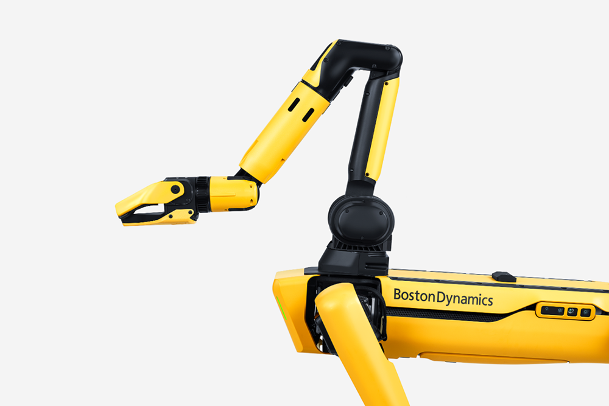
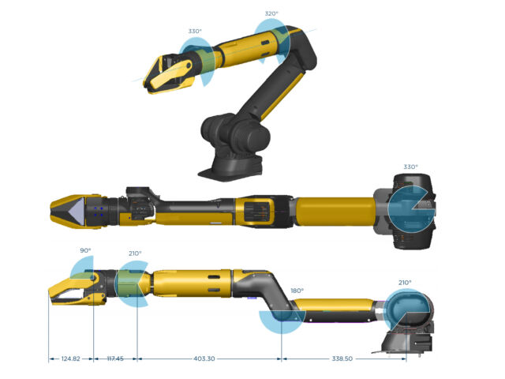
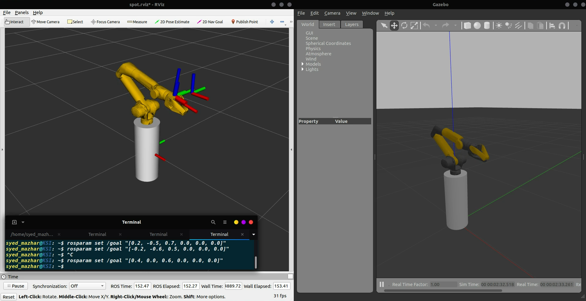
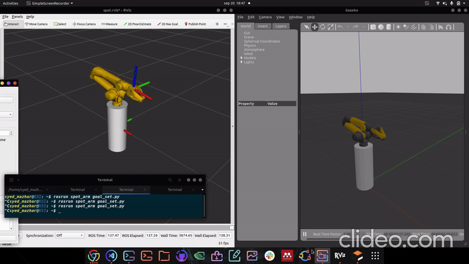
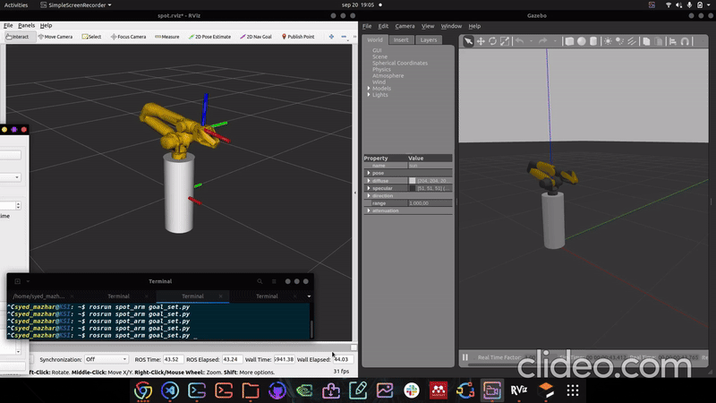

# Spot-Dog 7 DOF Kinematic Control (Boston Dynamics)

This repository is the implementation of the scientific paper titled "Task-Priority Based Redundancy Control of Robot Manipulators," specifically designed for the pick-and-place task.

# Spot Robot

  

# 7 DOF Robotic Arm

  

# Task-Priority Based Redundancy Control of Robot Manipulators in RViz and Gazebo

  

# Different Task priority:

## Position Control

The objective is to reach the goal point. 

## Configuration Control

The objective is to reach the goal point while maintaining the end-effector configuration. 

## Joint Limits

The objective is to reach the goal point while respecting the joint constraints on the arm. 

# For complete videos, please navigate to the videos folder.